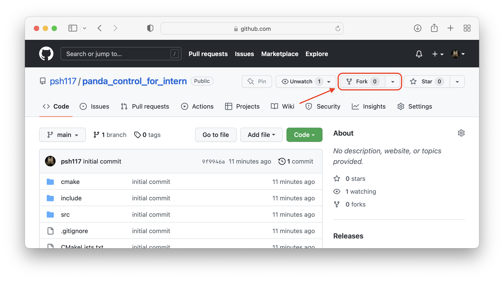

# PANDA CONTROL PROJECT FOR DYROS INTERNS

## How to use
1. fork this repo 


2. clone your repo in intern_ws (in `panda_rcu`)
```sh
cd ~/intern_ws # enter intern workspace

mkdir your_name # make your own workspace
cd your_name # enter the workspace

# clone your codes
git clone https://github.com/your_id/panda_control_for_intern

# enter the cloned project
cd panda_control_for_intern

# build the project
mkdir build
cmake .. -DCMAKE_BUILD_TYPE=RELEASE
make -j9
```

3. run

```sh
# in panda_control_for_intern/build

# position controlled
./panda_position_controller


# torque controlled
./panda_torque_controller
```


4. how to edit codes
* `src/main_torque_control.cpp`: main enterance of the torque controller program.
* `src/main_position_control.cpp`: main enterance of the position controller program.
* `src/controller.cpp`, `include/controller.h`: controller codes.